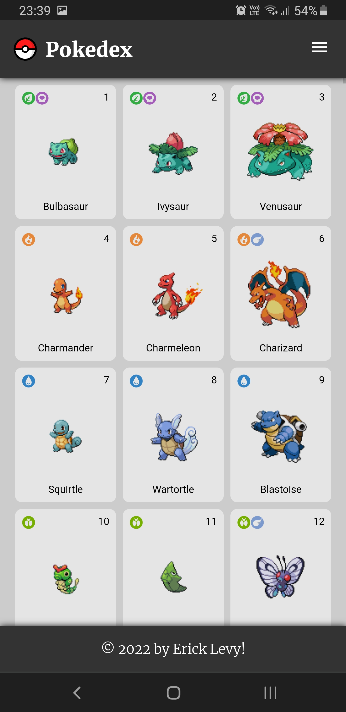
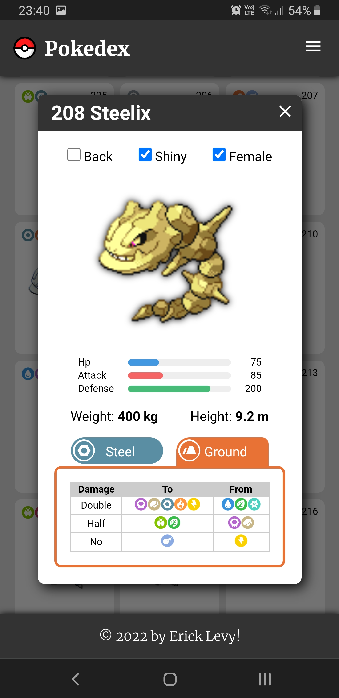

# pokedex

The Pokedex

© Copyright 2022 by Erick Levy

This is a personal front-end implementation to access to the poke API data services using HTML5, CSS3 and Javacript.

Thank you for taking the time to learn about and play with this little app.

Some of the front-end topics used in this little project:

* Fetching data from external API services
* HTML5 semantic web tags
* Javascript referencing and manipulation of DOM elements
* CSS3 flex displaying and distribution
* Custom modal windows for alerts and dialogs
* Dynamic CSS class assignment
* Intersection observers to fetch remote data until it's required
* Async, await and then constructions for asynchronous programming
* Implementation of tabs (tabify)
* Javascript collections, event listeners, timers, lambdas, promises
* And so on...

